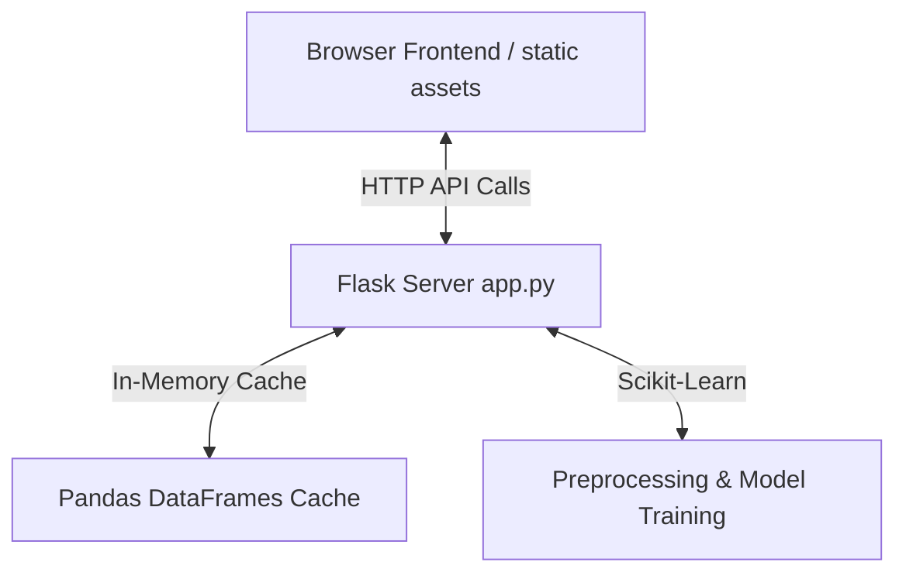

# Hamlin Software | AI Model Tuner & Evaluator

A local, Python-based application with a dynamic, glassmorphic user interface that allows machine learning models to be loaded, tuned, and evaluated against test datasets. The project is designed with a modular Flask backend and a modern HTML/CSS/JS frontend to provide real-time metrics, interactive confusion matrices, and model performance charts.

---

## Technical Architecture

The application uses a client-server architecture designed for local network execution and discoverability:



### 1. Backend (`app.py`)
- **Web Framework**: Flask
- **Data Core**: Pandas & Numpy for fast, in-memory data manipulation.
- **ML Engine**: Scikit-Learn pipelines, column transformers, and estimators.
- **State Management**: Uses a global Python dictionary `DATA_CACHE` in-memory to store parsed dataframes keyed by UUID tokens. This completely avoids disk I/O, prevents directory traversal vulnerabilities, and handles datasets securely.

### 2. Frontend (`templates/` & `static/`)
- **Structure**: Semantic HTML5 single page application.
- **Styling**: Vanilla CSS3 using custom HSL tokens, glassmorphism filters, responsive grids, and loading animations.
- **Interactive Logic**: Vanilla JS controls input configurations, hyperparameter building, AJAX requests, and DOM rendering.
- **Visualization**: Chart.js loaded locally offline-friendly to render fit curves and feature importances.
- **Security Check**: Employs strictly HTML-escaped DOM insertion (`textContent` and `document.createElement`) to secure against Cross-Site Scripting (XSS).

---

## Core Features

- **CSV File Upload**: In-memory parsing validating size limits (Max 5MB) and columns specification.
- **Quick Sample Datasets**: Immediate load-outs for **Housing Prices** (Regression task) or **Customer Churn** (Classification task).
- **Adaptive UI Suggestions**: Auto-detects target column types (numerical vs categorical) and dynamically restricts/enables corresponding classification or regression algorithms.
- **Feature Pipeline Tuning**: Active feature checkboxes and individual transformation selectors (StandardScaler, MinMaxScaler, OneHotEncoder, OrdinalEncoder).
- **Hyperparameter Customization Form**: Dynamically rendered inputs (sliders, drop downs, toggles) reading boundaries directly from the backend model configurations.
- **Directional Help Tooltips**: Visual `?` icons with contextual popovers aligned to avoid screen edges and table scroll overflow boundaries.
- **Logging Terminal Console**: Live micro-logs showing pipeline step progress.
- **Detailed Metrics & Plots**: Accuracy, precision, recall, F1, and HTML Confusion Matrix grids for classification; MSE, RMSE, MAE, R2, and prediction scatter plots for regression.

---

## Installation Rules

### Prerequisites
- Python 3.12+ (Tested on Python 3.14)
- Pip package manager

### Standard Setup
Install the scanned, verified dependencies:
```bash
pip install -r requirements.txt
```

*Note: If your system utilizes PEP 668 (externally-managed-environment), install using the `--break-system-packages` flag:*
```bash
pip install --break-system-packages -r requirements.txt
```

---

## Launch Rules & Connectivity Ports

Launch the Flask development server from the workspace root:
```bash
python3 app.py
```

### Connectivity Bindings
To allow discoverability and management by locally connected systems on the subnet, the server binds to `0.0.0.0` (all network interfaces) on port `5000`:
- **Local Loopback**: [http://127.0.0.1:5000](http://127.0.0.1:5000)
- **Local Network Subnet (e.g.)**: [http://10.0.0.192:5000](http://10.0.0.192:5000)

*Production Note: In production deployments, ensure local network firewalls restrict incoming access to trusted clients or run behind a reverse proxy with TLS authorization.*

---

## API Connectivity Reference

### 1. GET `/api/models`
Returns the metadata definitions of supported algorithms and their hyperparameters to build the UI configuration panels.

#### Sample Response:
```json
{
  "random_forest_classifier": {
    "name": "Random Forest Classifier",
    "type": "classification",
    "params": [
      {
        "name": "n_estimators",
        "label": "Number of Trees",
        "type": "int",
        "default": 100,
        "min": 10,
        "max": 500,
        "step": 10,
        "description": "The number of trees in the forest..."
      }
    ]
  }
}
```

### 2. GET `/api/sample-data`
Generates a synthetic dataset for quick evaluation.
- **Query Parameter**: `type` (`housing` or `churn`)

#### Sample Response:
```json
{
  "dataset_token": "sample_housing",
  "columns": [
    {"name": "SquareFeet", "type": "numerical", "unique_count": 427, "sample_values": ["2048", "1730"]}
  ],
  "sample_rows": [
    {"SquareFeet": 2048, "Bedrooms": 3, "Bathrooms": 3.0, "Price": 322000}
  ]
}
```

### 3. POST `/api/analyze-csv`
Accepts a multipart file upload (`.csv`), caches it in-memory, and returns schema analytics.
- **Payload**: Form-data with key `file` mapping to a `.csv` file.

### 4. POST `/api/evaluate`
Executes pre-processing pipelines, train/test splitting, estimator fit, and scores the model. Returns metrics and visual chart coordinates.

#### Sample Request Payload:
```json
{
  "dataset_token": "sample_housing",
  "model_type": "random_forest_regressor",
  "hyperparameters": {
    "n_estimators": 100,
    "max_depth": 10,
    "min_samples_split": 2
  },
  "features": [
    {"name": "SquareFeet", "active": true, "transform": "standard"},
    {"name": "Bedrooms", "active": true, "transform": "none"}
  ],
  "target_column": "Price",
  "train_split": 0.8
}
```

#### Sample Response Payload:
```json
{
  "status": "success",
  "model_type": "Random Forest Regressor",
  "metrics": {
    "R-squared (R2)": 0.9235,
    "Root MSE (RMSE)": 26739.78
  },
  "visualization": {
    "feature_importance": {
      "labels": ["SquareFeet", "Bedrooms"],
      "values": [0.6833, 0.0344]
    },
    "regression_results": {
      "actuals": [320000, 245000],
      "predictions": [318500, 251000]
    }
  }
}
```
